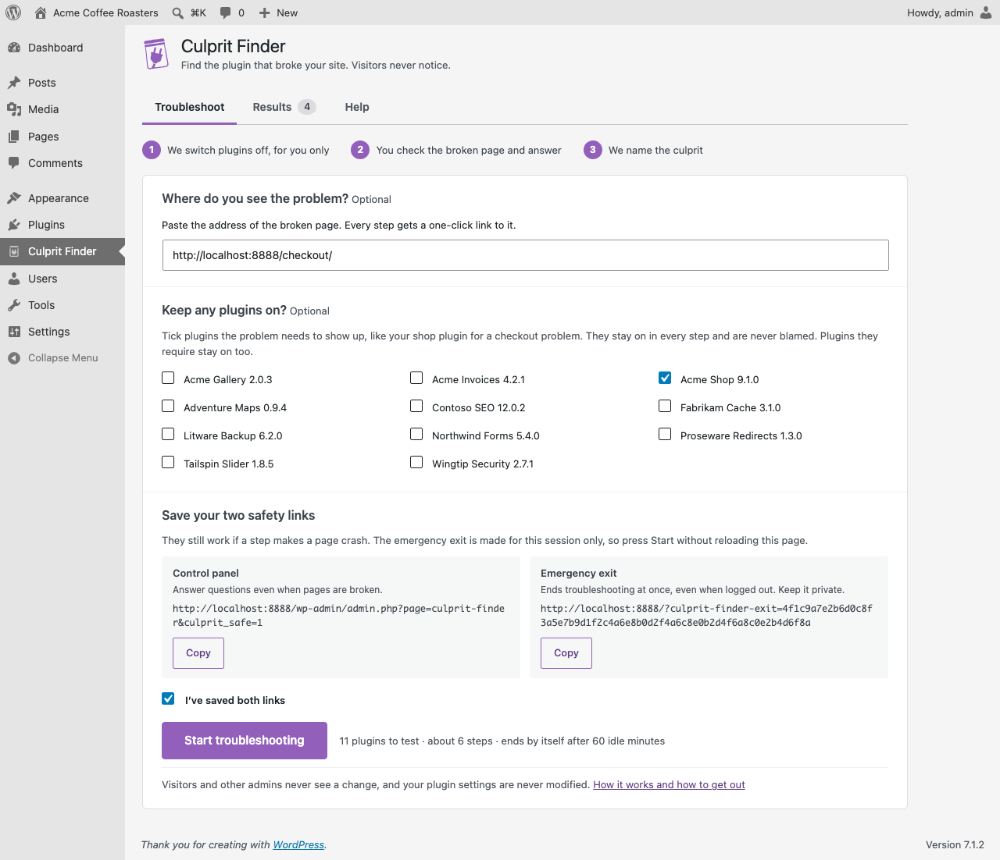
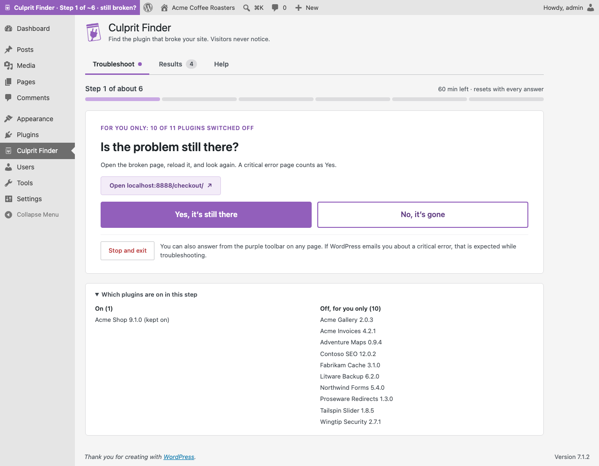
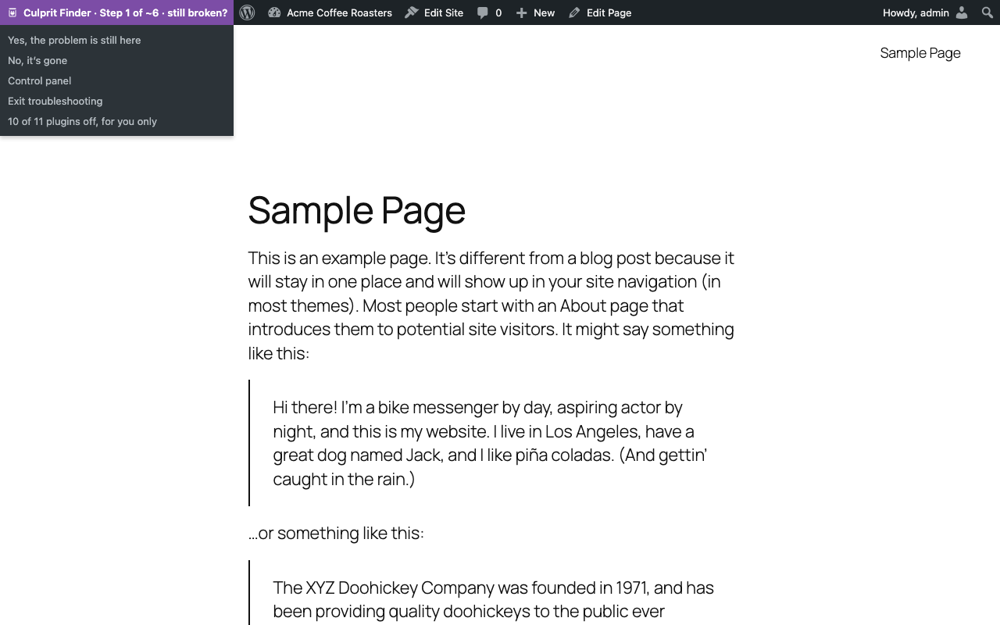
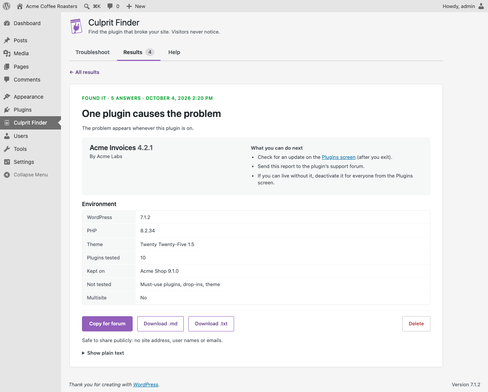

<picture>
  <source media="(prefers-color-scheme: dark)" srcset=".github/brand/culprit-finder-logo-white.svg">
  
</picture>

Find the plugin that broke your site. Visitors never notice.

**Culprit Finder** is a free WordPress plugin. When something on your site breaks, it switches plugins off **for your browser only**, asks after each change whether the problem is still there, and narrows things down until it names the plugin that causes it, or the two plugins that conflict with each other. Visitors and other admins see the normal site the whole time.

- About 7 answers for 30 plugins: each answer halves the list.
- Catches two-plugin conflicts, such as two plugins that only crash together.
- Nothing is deactivated, and your real plugin settings never change.
- Always a way out: Exit, an emergency exit link that works logged out, and an automatic end after an hour.
- A support report with no site address, user names or emails. Copy it, or download it as .md or .txt.
- No external requests, no tracking. Results stay on your site.

Website and docs: https://getculpritfinder.com · [Documentation](https://getculpritfinder.com/docs)

## Screenshots

| | |
|---|---|
|  |  |
| Pick plugins to keep on and save your two safety links. | One question per step: is the problem still there? |
|  |  |
| Answer from the toolbar on any page. | The culprit, what to do next, and a report ready for any support forum. |

## Install

1. Download the latest release zip (or install from WordPress.org once it's listed).
2. In WordPress, go to Plugins → Add New → Upload Plugin, choose the zip, and activate it.
3. Open **Culprit Finder** in the admin menu, bookmark the two safety links, and press **Start troubleshooting**.

Requires WordPress 6.5+ and PHP 7.4+. Single sites only (no multisite yet).

## Development

You need Docker, Node 18+, `jq` and `make`. PHP and Composer are optional: the Makefile runs them in Docker when they aren't installed.

```sh
make install     # dev dependencies (PHPUnit, WordPress Coding Standards)
make up          # disposable WordPress at http://localhost:8888 (admin / password)
make test        # lint + unit tests + release checks + end-to-end scenarios
make zip         # build/culprit-finder.zip
make zip-test    # install the zip on a fresh site and run a scenario against it
make compat      # WordPress 6.5/latest x PHP 7.4/newest matrix
make screenshots # WordPress.org screenshots (fictional demo plugins)
make banners     # WordPress.org banners and the website's social image
```

- `src/Engine/`: the search (pure PHP, unit-tested).
- `mu-loader/`: the tiny must-use loader that switches plugins off for one browser.
- `src/`: sessions, admin screens, report, WP-CLI command (`wp culprit-finder`), and [extension hooks](https://getculpritfinder.com/docs/developers/hooks/).
- `tests/e2e/`: end-to-end scenarios against wp-env with fixture plugins.
- The website (getculpritfinder.com) lives in its own repository, `culprit-finder-website`, next to this one.

See [CONTRIBUTING.md](CONTRIBUTING.md) to contribute and [SECURITY.md](SECURITY.md) to report a security issue privately.

## License

GPL-2.0-or-later. See [LICENSE](LICENSE).

Source code: GITHUB_REPO_URL
